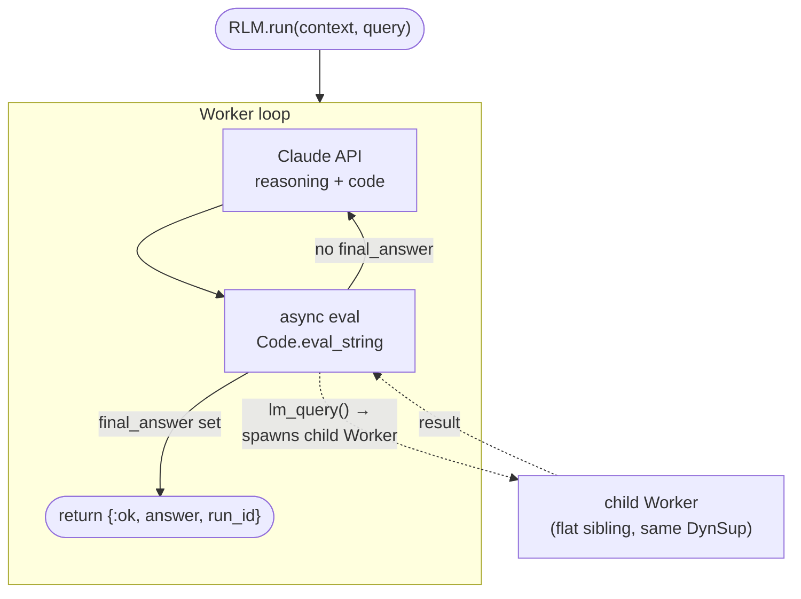
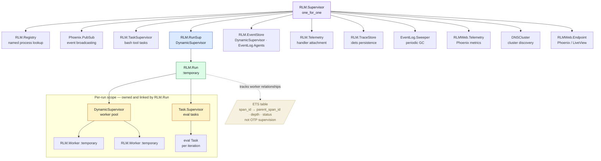

# RLM — Recursive Language Model Engine

This project is my exploration of coding agents and Recursive Language Models, built in
Elixir because OTP's supervision trees and process model felt like a natural fit for
managing recursive LLM spawning. I was inspired by a few things: the
[RLM paper](https://alexzhang13.github.io/blog/2025/rlm/) and its idea of LLMs writing
code in a loop, [Jbollenbacher's Elixir RLM](https://github.com/Jbollenbacher/RLM) which
I wanted to take further, and the design philosophy behind
[pi](https://github.com/badlogic/pi-mono/) — a coding agent that keeps things simple and
transparent. This is very much a learning project, but it works and it's been fun to build.

A single Phoenix application: an AI execution engine where Claude writes Elixir code that
runs in a persistent REPL, with recursive sub-agent spawning, built-in filesystem tools,
and compile-time architecture enforcement via [`boundary`](https://hex.pm/packages/boundary).

**One engine, two modes:**
1. **One-shot** — `RLM.run/3` processes data and returns a result
2. **Interactive** — `RLM.start_session/1` + `send_message/3` for multi-turn sessions with persistent bindings

---

## How it works

Each `RLM.run/3` call launches a **Worker** that runs an iterate loop: send the
conversation history to Claude, receive back `{reasoning, code}`, evaluate the code in a
sandboxed Elixir REPL, feed the output back, and repeat until the code sets a
`final_answer` variable.

The eval step runs in a separate lightweight process so the Worker stays responsive.
Code inside the REPL can call `lm_query/2` to hand off a sub-task to a **child Worker** —
that call goes to the Worker as a message, which it handles while eval waits for the
result. Without the async pattern this would deadlock.



Three invariants the engine enforces:
- Raw input data never enters the LLM context window — only metadata or previews
- Sub-LLM outputs stay in variables, never surfaced directly to the parent LLM
- Stdout is truncated head+tail to prevent context overflow

---

## Quick start

Requires Elixir ≥ 1.19 / OTP 27 and an [Anthropic API key](https://console.anthropic.com/).

```bash
export CLAUDE_API_KEY=sk-ant-...
mix deps.get && mix compile
mix test        # excludes live API tests
iex -S mix      # interactive shell
```

---

## Usage

### One-shot

```elixir
# Synchronous — returns {:ok, answer, run_id}
# run_id lets you retrieve the execution trace afterwards
{:ok, answer, run_id} = RLM.run(
  "line 1\nline 2\nline 3\nline 4",
  "Count the lines and return the count as an integer"
)
# => {:ok, 4, "run-abc123"}

# Async — returns immediately; result delivered as {:rlm_result, span_id, result}
{:ok, run_id, pid} = RLM.run_async(my_large_text, "Summarize the key themes")

# Retrieve the execution trace
tree = RLM.EventLog.get_tree(run_id)
```

### Interactive sessions

Bindings persist across turns. The Worker stays alive between messages.

```elixir
{:ok, sid} = RLM.start_session(cwd: ".")

{:ok, answer1} = RLM.send_message(sid, "List files in the current directory using bash")
{:ok, answer2} = RLM.send_message(sid, "Now read the README")

RLM.history(sid)   # full message history
RLM.status(sid)    # session status map
```

### IEx helpers

```elixir
import RLM.IEx

{session, _} = start_chat("What Elixir version is this project using?")
chat(session, "Now show me the supervision tree")
watch(session)     # attach a live telemetry stream
```

### Configuration overrides

```elixir
{:ok, result, run_id} = RLM.run(context, query,
  max_iterations: 10,
  max_depth: 3,
  model_large: "claude-opus-4-6",
  eval_timeout: 60_000
)
```

### Sandbox API

Functions available inside the LLM's eval'd code:

```elixir
# Data helpers
chunks(context, 1000)    # stream of 1000-byte chunks
grep("pattern", ctx)     # [{line_num, line}, ...]
preview(term, 200)       # truncated inspect
list_bindings()          # current bindings info

# Recursive LLM calls
{:ok, result} = lm_query("summarise this chunk", model_size: :small)
results       = parallel_query(["chunk1", "chunk2"], model_size: :small)

# Structured extraction — single direct LLM call, returns a parsed map
{:ok, %{"names" => names}} = lm_query("Extract names from: #{text}",
  schema: %{
    "type" => "object",
    "properties" => %{"names" => %{"type" => "array", "items" => %{"type" => "string"}}},
    "required" => ["names"]
  }
)

# Filesystem tools
{:ok, content} = read_file("path/to/file.ex")
{:ok, _}       = write_file("output.txt", "content")
{:ok, _}       = edit_file("file.ex", "old text", "new text")
{:ok, output}  = bash("mix test")
{:ok, matches} = rg("defmodule", "lib/")
{:ok, files}   = find_files("**/*.ex")
{:ok, listing} = ls()
```

---

## Architecture

### OTP supervision tree

> **New to OTP?** A *Supervisor* is a process whose only job is to start and monitor
> other processes; a *DynamicSupervisor* spawns children on demand at runtime.
> A *GenServer* is a long-lived process with a message inbox — Elixir's version of an actor.



All Workers at all recursion depths are **flat siblings** under the run's single
`DynamicSupervisor`. The parent-child depth relationship is recorded in an ETS table
(Erlang's built-in in-memory key-value store) owned by `RLM.Run`, not encoded in OTP
supervision. Workers use `restart: :temporary` — they exit after completing their task
and are never restarted.

### Architecture boundaries

Enforced at compile time via [`boundary`](https://hex.pm/packages/boundary):

| Layer | Module | Rule |
|---|---|---|
| Core engine | `RLM` | Zero web dependencies |
| Web dashboard | `RLMWeb` | Depends only on `RLM` |
| Application | `RLM.Application` | Starts the unified supervision tree |

See [`docs/GUIDE.html`](docs/GUIDE.html) for the full architecture reference — module map,
async-eval pattern walkthrough, telemetry event catalogue, and all configuration fields.

---

## Observability

### Event log

```elixir
{:ok, _result, run_id} = RLM.run(context, query)

tree  = RLM.EventLog.get_tree(run_id)    # recursive span tree
jsonl = RLM.EventLog.to_jsonl(run_id)
File.write!("trace.jsonl", jsonl)
```

The LiveView dashboard at `http://localhost:4000` shows the same span tree live with
expandable iteration cards for every run in the current session.

### Telemetry

17 events fire during execution. Attach your own handler:

```elixir
:telemetry.attach("my-handler", [:rlm, :iteration, :stop],
  fn _event, measurements, meta, _ ->
    IO.puts("Iteration #{meta.iteration} — #{measurements.duration_ms}ms")
  end, nil)
```

Event families: `[:rlm, :node, :*]`, `[:rlm, :iteration, :*]`,
`[:rlm, :llm, :request, :*]`, `[:rlm, :eval, :*]`,
`[:rlm, :subcall, :*]`, `[:rlm, :direct_query, :*]`

### PubSub

```elixir
Phoenix.PubSub.subscribe(RLM.PubSub, "rlm:runs")
Phoenix.PubSub.subscribe(RLM.PubSub, "rlm:run:#{run_id}")
```

---

## Distributed Erlang

Connect multiple RLM nodes for remote execution:

```elixir
RLM.Node.start()
# => {:ok, :rlm@hostname}

RLM.Node.rpc(:"rlm@other_host", Kernel, :+, [1, 2])
# => {:ok, 3}

import RLM.IEx
remote(:"rlm@other_host", "Summarize the key themes", context: my_large_text)
```

Configure for releases:

```bash
RLM_NODE_NAME=rlm   # defaults to release name
RLM_COOKIE=secret   # shared secret for node authentication
```

---

## Security

RLM executes LLM-generated Elixir code via `Code.eval_string` with full access to the
host filesystem, network, and shell. **Do not expose RLM to untrusted users or untrusted
LLM providers.** It is designed for local development, trusted API backends (Anthropic),
and controlled environments. There is no sandboxing beyond process-level isolation and
configurable timeouts.

---

## License

This project is licensed under the [MIT License](LICENSE).
